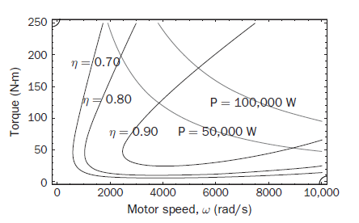

La eficiencia de un motor es un parámetro importante y este parámetro es definido como: 
$$\eta_m= \frac{\text{output Power}}{\text{input Power}}$$
Pero **la potencia de salida se puede ver como la potencia de entrada mas perdidas**, por lo que al reescribir la potencia de salida en términos de la potencia de entrada y esta a su ver en términos del torque nos queda la ecuación. 

$$\eta_m= \frac{T_{\omega}}{T_{\omega}+k_cT^2+k_i\omega+K_\omega\omega^3+C}$$
**$k_cT^2$**: Es la **perdida de cobre** y  modela las perdidas debida a la resistencia eléctrica debida a la resistencia eléctrica en los devanados de cobre. 

principalmente cubre las perdidas debidas al estator. 

**$k_i\omega$**: Es la **perdida de hierro** y  modela la perdida debido a los componentes del motor construidos en hierro. 

Existe dos formas de ocasionar las perdidas debidas al hierro y son las siguientes: 
1) La primera causa es debido a la magnetización y desmagnetización de los componentes de hierro. 
> Desmagnetizar y magnetizar el hierro requiere el consumo de potencia.

2) El campo magnético cambiante genera una corriente inducida sobre el hierro lo que hace que el hierro se caliente. 
Ambos efectos dependen de la frecuencia a lo que cambia el campo magnético por lo que esto hace que se  dependa de la velocidad angular.  

**$k_\omega\omega$**: Es la resistencia aerodinámica y esta es la resistencia que el aire ejerce sobre el rotor.
*Esta es despreciable a bajas revoluciones y es proporcional a la velocidad angular al cubo* 

$C$: Es la potencia constante, este factor recopila las potencias que no dependen de $T$ y $\omega$ 

## Mapa de eficiencia del motor 
El mapa de eficiencia del motor es una grafica que podemos hacer si conocemos los valores de $k_c,k_i,k_\omega$ y $C$, ya conociendo estos valores podemos graficar la eficiencia del motor en terminos del torque $T$ y la velocidad angular $\omega$. 

> [!NOTE] Importante 
> El mapa es mecánico todo es relacionado con la mecánica.
> 

### ¿Cómo leerla? 
La grafica puede contener curvas de eficiencia y curvas de potencia y saber interpretarlas es parte clave de saber usar el mapa de eficiencia del motor. 

>[!NOTE] curva de eficiencia y potencia 
>la curva de eficiencia es una región 
>la curva de potencia es una lineal.

  
  
   
<em>Figura 1. Curva de eficiencia de un motor de 100 kW</em>  

##### Curvas de eficiencias
Las curvas de eficiencia funcionan como islas por lo que dentro de ellas el valor es de una eficiencia similar o mayor al valor al valor de la curva que lo contiene en la isla "el contorno". 

#### Curva de potencia 
Las curvas de potencia no funcionan como isla solo los puntos que están sobre ella tienen ese valor de potencia ósea la potencia indicada.

