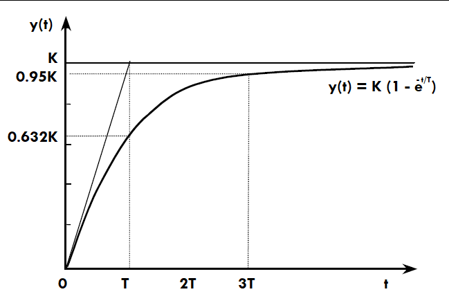
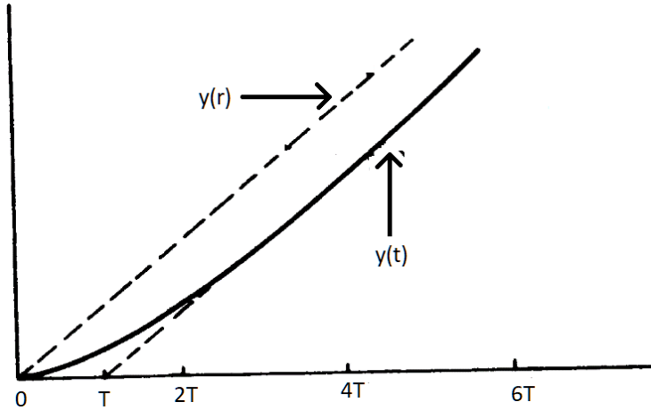

#control #sistemasPrimerOrden 

**TABLA DE CONTENIDO** 

## Descripción 
Los sistemas de control de primer orden son los mas sencillos que podemos encontrar y están regidos por las siguientes características fundamentales:
- poseen un solo polo. 
- poseen solo un mecanismo de almacenamiento de energía.
- están definidos por una ecuación diferencial de primer orden.

> Todos los sistemas de primer orden presentan una respuesta suave sin oscilaciones  bruscas, tiene forma similar a una exponencial que se estabiliza en un punto o una exponencial decreciente o en el caso de un sistema excitado con una rampa se estabiliza en una trayectoria. 

  
   
 <em>Figura 1.  respuesta creciente de un sistema de primer orden</em>

  
   
  <em>Figura 2.  respuesta decreciente de un sistema de primer orden</em>

### Estructura matemática 
En la estructura de la función de transferencia para sistemas de primer orden tenemos, la función de transferencia con retardo y sin retardo. 

#### Ecuación sin retardo 
$$ \frac{H(s)}{\alpha(s)} = \frac{K}{\tau s +1} $$
$H(s)$ Salida del sistema 
$\alpha (s)$ Entrada del sistema 
$K$ Ganancia estática del sistema
$\tau$ La constante de tiempo del sistema 

#### Ecuación con retardo 
$$ \frac{H(s)}{\alpha(s)} = \frac{K}{\tau s +1}e^{-\theta s} $$
$H(s)$ Salida del sistema 
$\alpha (s)$ Entrada del sistema 
$K$ Ganancia estática del sistema
$\tau$ La constante de tiempo del sistema 
$\theta$ Retardo de tiempo del sistema

> [!NOTE] Diferencia de retardo y sin retardo 
> La diferencia radica en el comportamiento después de ejecutar la señar de entrada en los sistemas sin retardo la salida ocurre de manera instantánea y en las que tienen retardo no ocurra de manera instantánea.

---
### Sistema de primer orden  sin retardo 

la función de transferencia de un sistema de primer orden sin retardo esta dado por la expresión $\frac{H(s)}{\alpha(s)}=\frac{K}{\tau s +1}$ si miramos el polo de la expresión nos damos cuenta que el polo es negativo $s=-\frac{1}{\tau}$ lo que nos genera un sistema estable, es decir en algún momento la salida se termina de estabilizar.  

IMAGEN 
IMAGEN 

**¿Cómo determino el valor de la salida en estado estable:?**
Para hallar este valor usamos el teorema del valor final, el procedimiento es el siguiente se toma la función de transferencia y se le saca el limite cuando t tiende al infinito.  
$$h_{ee}= \lim_{t \to \infty} AK(1- e^{\frac{-t}{\tau}})=AK$$

Donde $AK$ es el valor donde se estabiliza. 

##### Truco para encontrar la constante de tiempo de manera grafica 
la derivada del sistema de primer orden tiene una derivada no nula en el origen 
*falta escribir y graficar* 

#### Respuesta de un sistema de primer orden 
La respuesta del sistema de primer orden depende de la entrada que le coloquemos al sistema.

los tipos de entrada que tenemos son los siguientes. 

| Entrada |   Tiempo    |     Laplace     |
| :-----: | :---------: | :-------------: |
| impulso | $\delta(t)$ |        1        |
| Escalon |     $A$     |  $\frac{A}{s}$  |
|  Rampa  |     $t$     | $\frac{1}{s^2}$ |

