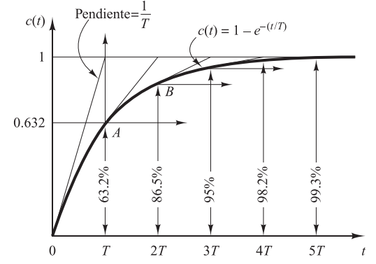

#control 

Como la transformada de Laplace de un escalón unitario es $\frac{1}{s}$ al remplazar en  la formula de ganancia sin retardo se obtiene. 

$$ C(s) = \frac{1}{\tau s +1}\frac{1}{s}$$
Al realizar fracciones parciales se obtiene
$$C(s) = \frac{1}{s}- \frac{\tau}{\tau+s}=\frac{1}{s}-\frac{1}{s+(\frac{1}{\tau})}$$

 Con la respuesta temporal 
 $$C(t)=1-e^{\frac{-t}{\tau}}; \quad   t\geq 0 $$

  
   
 <em>Figura 1.  Curva de respuesta exponencial</em>

Algo curioso de este sistema es que cuando hacemos que $t=\tau$ el valor de $c(t)$ es de 0.632 lo que nos dice que la salida alcanzo el 63,2% de su cambio total. 

Conforme el  $\tau$ se hace mas pequeño el sistema es mas rápido, esto se debe a que la exponencial esta elevada al termino $\frac{t}{\tau}$ lo que hace que un tao pequeño hace que la exponencial de caiga mas rápido, eliminando velocidad de la respuesta transitoria.

#### ¿Por qué decimos que el sistema tarda 4 $\tau$ en estabilizarse? 

==la siguiente explicación es cuando el sistema tiene $k=1$== 
