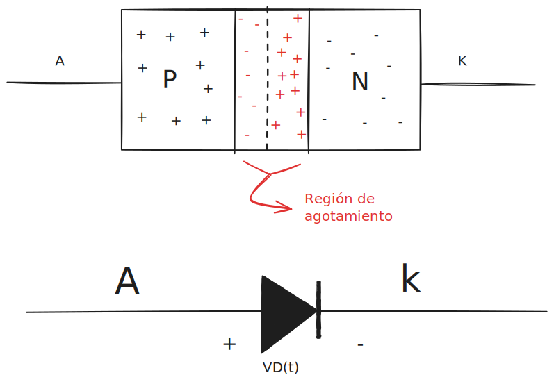
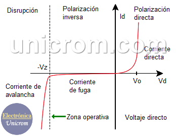

#diodos  #electronicaPotencia

### Introducción
**Diodos semiconductores:** los diodos semiconductores tienen un pico de potencia cuando se conmuta *"Se pasa de un estado a otro"*.

El diodo tiene dos perdidas importantes: 
- perdida por conducción.
- perdida por conmutación.

> un dispositivo semiconductor de potencia ideal soporta una tensión infinita en bloqueo 

### Algunos tipos de diodos 
##### Diodo de recuperación rápida
Son diodos que soportan una alta corriente y son mas rápidos con conmutaciones menores a 10 microsegundos. 

*Es usado en inversores ya que puede usarse en aplicaciones donde las señales superen los kHz.*

##### Diodo Shockley 
Son diodos con un tiempo de recuperación rápido pero con un manejo de corriente y tensión bajo.

---

## Diodos semiconductores 
El diodo es una unión PN  alrededor de la cual se crea una región de agotamiento y en esa región de agotamiento no tenemos portadores de carga libres, esto debido al proceso de recombinación.

*La región de agotamiento crea una diferencia de potencial que impide el flujo de electrones.*

Simbología 

  
   
  <em>Figura 1.  Estructura y simbología del diodo.</em>

Los diodos tienen tres regiones de operación que se nombran a continuación 
- **Región de polarización directa**:  donde $V_D >0$ 
- **Región de polarización inversa:** donde $-V_{BR}<V_D<0$
- **Región de ruptura o región de avalancha:** Es una región donde ocurre un proceso de conducción inversa y se cumple cuando $V_D <-V_{BR}$

> $V_{BR}$ es la tensión de ruptura.
#### Cosas a tener en cuenta 
- La corriente del diodo va de ánodo a cátodo.
- La tensión umbral es de $0.6[V]$ a $0.7[V]$  y $2[V]$ en diodos de potencia. 
- La corriente de fuga es proporcional al área transversal del diodo. 
-

  
   
  <em>Figura 2. regiones de polarización del diodo.</em>

