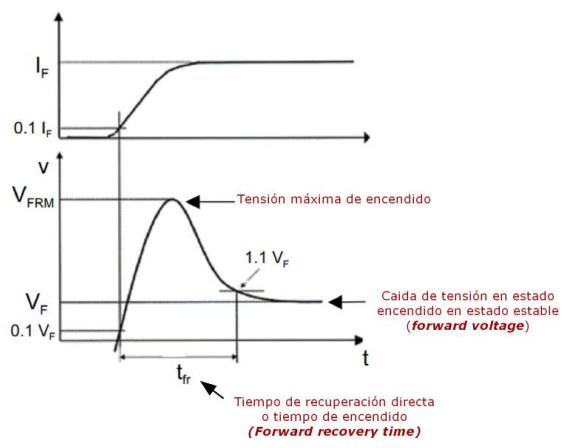
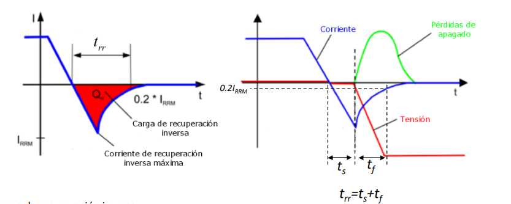

#diodos #electronicaPotencia 

#### Introducción 
Cuando el diodo pasa de una región a otra ocurre un comportamiento dinámico y ese comportamiento dinámico es que el diodo no conmuta instantáneamente ocurre un transitorio.  

### Encendido 
En este caso estamos en inversa y encendemos el diodo. Cuando pasamos de la región de corte a la región de conducción ==el diodo eleva su tensión llegando a una tensión máxima y luego se estabiliza== y el tiempo es el que ocurre ==este fenómeno se llama tiempo de recuperación directa ==. 

$t_{fr}$= tiempo de recuperación directa o forward recovery time

> Este tiempo es importante ya que en aplicaciones de frecuencia es útil conocer el tiempo de conmutación del diodo.

#### ¿Cómo se calcula el tiempo de recuperación directa $t_{fr}$?
Este tiempo es el transcurrido desde el valor $0.1V_F$ hasta $1.1V_F$ donde $V_F$  *"forward voltage"* es la tensión en estado estable ósea la tensión del diodo después del pequeño pico. 

  
   
  <em>Figura 1.  Tiempo de recuperación directa.</em>

### Apagado 
Este tiempo es mas largo que el tiempo requerido para el encendido ya que este tiempo es definido como el tiempo requerido para crear la región de agotamiento. 

#### ¿Cómo se calcula el tiempo de recuperación inversa $t_{rr}$?
El tiempo de recuperación inverso se empieza a medir desde quela corriente es cero hasta donde la corriente toma el valor de $0.2I_{RRM}$. 

El tiempo de recuperación inverso  se puede dividir en dos tiempos $t_{rr}=t_s+t_f$ 

  
   
  <em>Figura 1.  Tiempo de recuperación inversa.</em>

- $t_{rr}$: tiempo de recuperación inverso 
- $I_{RRM}$: corriente de recuperación inversa máxima
- $t_s$: **tiempo de almacenamiento:** es desde el cruce inicial de la corriente en cero hasta su pico inverso $I_{RRM}$. 
- $t_f$: tiempo de caída: es desde que la corriente llega a su pico máximo $I_{RRM}$ hasta que llega al 20% de ese valor máximo $0.2I_{RRM}$
- $Q_{rr}$: Carga de recuperación inversa 

> [!NOTE] IMPORTANTE 
> Al conocer la dinámica del diodo es importante tener en cuenta lo siguiente: 
> - los parámetros dinámicos del diodo están en la hoja de datos. 
> - en los dispositivos de alta potencia se busca que el diodo sea mayormente ideal con tensión cero y soportar corriente cero en inverso junto con los tiempos de recuperación inverso y directo cero. 

#### ¿Qué hacer cuando no tenemos el tiempo de recuperación inversa?
En caso de no tener el tiempo de recuperación inversa podemos calcularlo si conocemos otros datos y con el apoyo de las siguientes ecuaciones. 

$$
I_{\mathrm{RRM}} \approx t_s \, \frac{di}{dt}
$$

$$
Q_{rr} \approx \frac{I_{\mathrm{RRM}}\, t_{rr}}{2}
$$

$$
t_{rr} \approx \frac{2\,Q_{rr}}{I_{\mathrm{RRM}}}
$$
