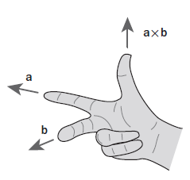
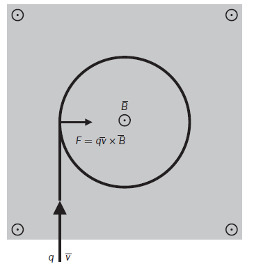

#TeoriaElextromagnetica 

> [!NOTE] Definición 
> La ley de fuerza de Lorenz establece que **cuando una carga cargada eléctricamente interacciona con un campo electromagnético este campo ejerce una fuerza sobre la carga**. 

Esta ley se expresa en la siguiente expresión matemática. 

$$\vec{F}=q(\vec{E}+\vec{v} \times \vec{B}) \tag{1}$$

**En la expresión anterior se expresa:** 
- $\vec{F}$ Es la fuerza impresa en la carga 
- $q$ Es el valor de la carga eléctrica de la partícula 
-  $\vec{v}$ Es la velocidad a la que se mueve la carga 
-   $\vec{E}$ Es el  vector campo Eléctrico  
-  $\vec{B}$ Es el  vector campo magnético 

##### Para tener en cuenta 

- La fuerza de Lorenz es ==aplicada perpendicularmente== a la ==velocidad== de la carga. 
- En algunos casos ==como aproximación se tiene en cuenta solo la componente generada por el campo magnético== un caso practico dónde sucede esto es cuando se esta analizando el comportamiento de los coches  eléctricos.

**De ahora en adelante cada vez que hablemos de la ley de fuerza de Lorenz hacemos referencia al estudio de la componente generada por el campo magnético.** 

### ¿Cómo obtener la dirección del vector fuerza? 

La dirección del vector fuerza se puede sacar por medio de la regla de la mano derecha y esto es debido a que estamos  usando un producto cruz.  

> El vector fuerza de Lorenz es perpendicular tanto a la velocidad como al campo magnético.

  
   
  <em>Figura 1.  Regla de la mano derecha.</em>

**La ubicación de los dedos es la siguiente**
- **Índice:** dirección de la velocidad de la carga $\vec{v}$ 
- **Medio:** dirección del campo magnético $\vec{B}$
- **Pulgar**: dirección de la fuerza  $\vec{F}$

>**La regla de la mano derecha se aplica a las cargas positivas en caso de que la carga sea negativa, se usa la misma regla pero en sentido contrario.** 

### ¿Qué relación existe entre la fuerza de Lorenz y un movimiento circular?

Debido a que la fuerza de Lorenz es perpendicular a la velocidad de la carga esta fuerza no acelera la carga por lo que le hace a la misma es un cambio de trayectoria, generando una trayectoria circular. 

  
   
  <em>Figura 1.  Trayectoria comprendida por una carga.</em>

### ¿Qué pasa si  es  un grupo de cargas?

Un 